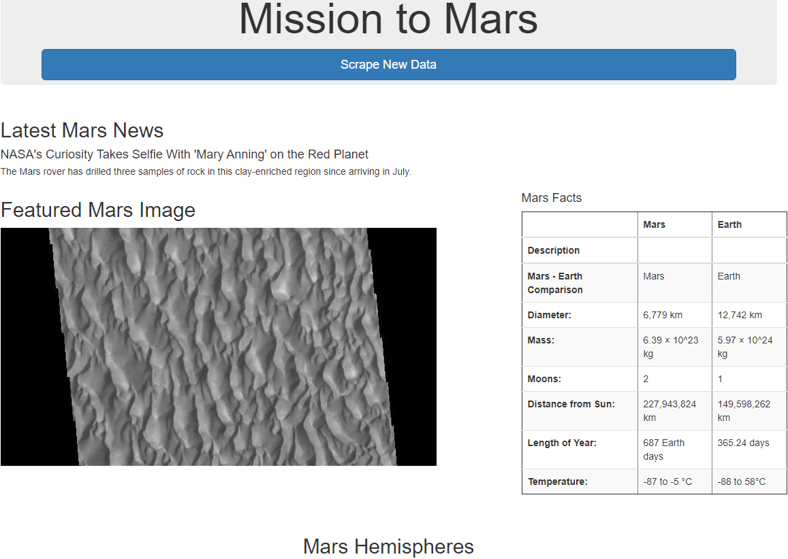
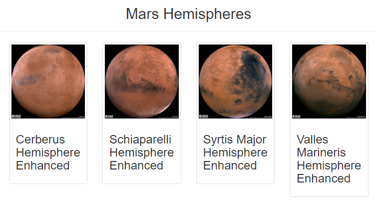
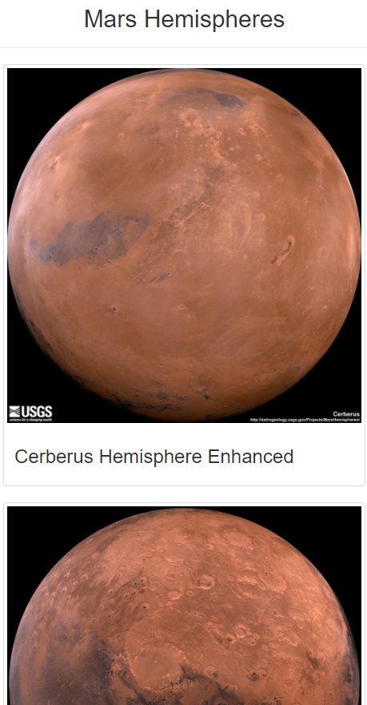

# Mission-to-Mars

## Overview of Project
Robin's web app is looking good and functioning well, but she wants to add more polish to it. She had been admiring images of Mars’s hemispheres online and realized that the site is scraping-friendly. She would like to adjust the current web app to include all four of the hemisphere images. To do this, you’ll use BeautifulSoup and Splinter to scrape full-resolution images of Mars’s hemispheres and the titles of those images, store the scraped data on a Mongo database, use a web application to display the data, and alter the design of the web app to accommodate these images.

## Results
We added a 'hemispheres' key to the data dictionary along with adding a new function that scrapes https://marshemispheres.com/ for the different image links and titles. Then we output those links and titles in the index.html file. We also added a little bit of styling using Bootstrap 3. We changed the size of the scraping button:

And we also added a change so the Hemisphere images would all show when looking at a tablet and then would go to single images per row when changing to mobile size. See Tablet:

See Mobile:

